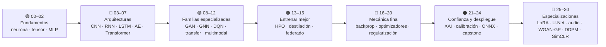

<div align="center">

# 🧠 Neural Network Training Labs

## **31 rutas · 93 notebooks · 19 fuentes públicas reales · de la neurona en NumPy al modelo desplegado**

**Laboratorio evolutivo y verificable para entrenar, validar, explicar, exportar y
desplegar redes neuronales: de la derivada escrita a mano a CNN, RNN, transformers,
GAN, GNN, refuerzo, difusión y aprendizaje autosupervisado — con semillas separadas,
sellado del `test`, model cards, registro champion/challenger, API de inferencia,
ONNX/INT8/edge, entrenamiento distribuido y cadena de suministro firmable.**

[](https://github.com/vladimiracunadev-create/neural-network-training-labs/actions/workflows/ci.yml)
[](https://github.com/vladimiracunadev-create/neural-network-training-labs/actions/workflows/notebooks.yml)
[](https://github.com/vladimiracunadev-create/neural-network-training-labs/actions/workflows/security.yml)
[](https://github.com/vladimiracunadev-create/neural-network-training-labs/actions/workflows/docs.yml)
[](https://github.com/vladimiracunadev-create/neural-network-training-labs/actions/workflows/deploy-pages.yml)

[](CHANGELOG.md)
[](labs/)
[](#-notebooks-evaluables)
[](docs/learning-path.md)
[](labs/)
[](LICENSE)

[](pyproject.toml)
[](pyproject.toml)
[](labs/)
[](docs/export-and-edge.md)
[](Dockerfile)
[](https://vladimiracunadev-create.github.io/neural-network-training-labs/)

[🌐 **Sitio de estudio (vivo)**](https://vladimiracunadev-create.github.io/neural-network-training-labs/) ·
[🧭 Ruta](docs/learning-path.md) ·
[🔬 Protocolo de experimento](docs/experiment-protocol.md) ·
[📚 Documentación](docs/index.md) ·
[🗄️ Datasets](docs/datasets.md) ·
[🏗️ Arquitectura](docs/architecture.md) ·
[🗺️ Roadmap](ROADMAP.md) ·
[🤝 Contribuir](CONTRIBUTING.md) ·
[🔐 Seguridad](SECURITY.md)

<br>

| 🧪 Rutas | 📓 Notebooks | 🗄️ Fuentes reales | 🧰 Comandos CLI | 📖 Guías | ⚙️ Workflows |
|:---:|:---:|:---:|:---:|:---:|:---:|
| **31** | **93** | **19** | **26** | **23** | **12** |

</div>

---

> [!IMPORTANT]
> Este repositorio **no reemplaza** al programa general de IA: es su
> profundización de entrenamiento profundo. Donde
> [`artificial-intelligence-evolution-program`](https://github.com/vladimiracunadev-create/artificial-intelligence-evolution-program)
> recorre la evolución completa del campo, aquí se baja al taller: una ruta, un
> dataset público real, un contrato de experimento y un artefacto desplegable.
> `python-data-science-program` y `langgraph-realworld` cubren el resto de la cadena.

## ✅ Estado verificable (v1.0.0)

| Superficie | Estado |
|---|---|
| Rutas | ✅ 31/31 construidas — 25 laboratorios centrales + 6 especializaciones avanzadas |
| Notebooks | ✅ 31 recorridos + 31 estudiante + 31 solución (93 en total) |
| Datasets | ✅ 31 fichas `dataset.yaml` sobre 19 fuentes públicas reales (UCI, Torchvision, Torchaudio, Hugging Face, PyG, Kaggle); **sin fallback sintético silencioso** |
| Protocolo | ✅ `split_seed` ≠ `training_seed`, selección por `validation`, `test` sellado con `experiment.lock.json` |
| CLI | ✅ 26 comandos: `catalog`, `dataset`, `audit`, `train`, `benchmark`, `registry`, `serve`, `export`, `supply-chain`… |
| Registro | ✅ champion/challenger local + backend MLflow opcional |
| Servicio | ✅ API FastAPI con `/predict`, `/drift`, `/metrics` Prometheus y OpenTelemetry opcional |
| Exportación | ✅ ONNX con verificación de paridad e INT8; ⚪ ExecuTorch opcional según toolchain |
| Distribuido | ✅ DDP y FSDP2 vía `torchrun`; ⚪ requiere varias GPU para valer de verdad |
| Sitio | ✅ GitHub Pages con navegación anterior/siguiente por laboratorio |
| CI | ✅ estructura, contratos de notebooks/nbgrader, `ruff`, tests sin red y auditoría SBOM + SHA-256 |
| Entrenamientos largos y descargas | ⚪ pruebas externas marcadas aparte — **no se fingen en CI** |

**Qué verifica una máquina y qué no**, para que sepas de qué te fías: la CI compila el
código, corre `pytest -m "not network and not slow"`, valida la estructura del repositorio
y los contratos educativos, y ejecuta `ruff` más la auditoría de cadena de suministro. Las
descargas y los entrenamientos largos viven en workflows separados (`real-data-smoke`,
`advanced-smoke`, `benchmark`, `distributed`, `edge`) precisamente para que un fallo de red
se vea como lo que es, y no quede tapado por un dataset sintético.

## 🌟 Qué hace diferente a este laboratorio

- Enseña el **protocolo de experimento antes que la arquitectura**: sin `experiment.lock.json`, ningún resultado en `test` cuenta.
- Separa dos aleatoriedades que casi todo el material mezcla: **la partición** (`split_seed`) y **el entrenamiento** (`training_seed`).
- Cada ruta termina en un **artefacto verificable**: model card, contrato de inferencia, métricas con intervalos y reporte.
- Los cuadernos **no son la misma plantilla repintada**: visión mira errores por clase, texto mira atención, series hace backtesting, grafos compara GCN/GraphSAGE/GAT, generación mide colapso.
- Los datasets se **descargan de su fuente**, con licencia declarada; una descarga fallida falla, no se disfraza.
- No declara “producción” sin evidencia: calibración, subgrupos, deriva y latencia se miden, no se prometen.

## 🧬 El recorrido, de la derivada al despliegue



Y dentro de **cada** ruta, siempre el mismo contrato:

```text
fuente pública real → descarga y licencia → train / validation / test
      → línea base en validation → selección del modelo
      → experiment.lock.json (sellado)
      → evaluación final en test (una sola vez)
      → model card + dataset card → registro champion/challenger
      → API, ONNX, INT8 o edge
```

<a id="laboratorios"></a>

## 🗂️ Las 31 rutas, en orden

> **El número es el orden.** Se estudia de la **00** a la **30**, sin saltos: la
> navegación *anterior / siguiente* de cada laboratorio —en el Markdown, en el sitio
> y en la página HTML local— sigue exactamente esta secuencia. Los siete bloques de
> abajo son tramos **contiguos** de ese mismo recorrido, no un orden alternativo.

Cada laboratorio publica cuatro documentos enlazados entre sí —
[`README.md`](labs/03_cnn_vision/README.md) (guía),
[`theory.md`](labs/03_cnn_vision/theory.md) (teoría y referencias),
[`experiments.md`](labs/03_cnn_vision/experiments.md) (plan experimental) y
[`assessment.md`](labs/03_cnn_vision/assessment.md) (evaluación y rúbrica) —
más sus tres cuadernos y su página `index.html` autocontenida.

### 🟢 Rutas 00–02 · Fundamentos: de la derivada a la primera red

Se construye una red desde cero antes de usar cualquier abstracción.
**Al terminar:** entiendes qué calcula, qué deriva y qué actualiza un entrenamiento.

| # | Ruta | Qué resuelve | Dataset |
|---:|---|---|---|
| 00 | [🔢 Neurona con NumPy](labs/00_numpy_neuron/) | Propagación, entropía cruzada y descenso de gradiente sin autograd | Breast Cancer Wisconsin |
| 01 | [🧩 Perceptrón con PyTorch](labs/01_pytorch_perceptron/) | Tensores, autograd, optimizadores y clasificador lineal | Banknote Authentication |
| 02 | [🌀 MLP multiclase](labs/02_mlp_nonlinear/) | Capas densas, activaciones y la primera frontera no lineal | Dry Bean |

### 🔵 Rutas 03–07 · Arquitecturas según la forma del dato

Cada estructura —imagen, secuencia, serie, señal sin etiqueta, texto— pide su propio
sesgo inductivo. **Al terminar:** eliges arquitectura por la forma del problema, no por la moda.

| # | Ruta | Qué resuelve | Dataset |
|---:|---|---|---|
| 03 | [🖼️ CNN para visión](labs/03_cnn_vision/) | Convolución, pooling y análisis de errores por clase | CIFAR-10 |
| 04 | [🔁 RNN para texto](labs/04_rnn_sequences/) | Embeddings, padding y recurrencia sobre sentimiento | IMDb |
| 05 | [📈 LSTM para series temporales](labs/05_lstm_time_series/) | Memoria larga y pronóstico que respeta el orden temporal | Seoul Bike |
| 06 | [🧬 Autoencoder para fraude](labs/06_autoencoder_anomaly/) | Anomalías por error de reconstrucción, sin etiquetas de fraude | Credit Card Fraud |
| 07 | [🔭 Transformer para noticias](labs/07_transformer_attention/) | Atención multi-cabeza implementada desde cero | AG News |

### 🟣 Rutas 08–12 · Familias especializadas: generar, decidir, relacionar

Tres regímenes donde una métrica de acierto ya no cuenta toda la historia, más las
dos formas de reutilizar y combinar información. **Al terminar:** evalúas sistemas
sin una única etiqueta correcta.

| # | Ruta | Qué resuelve | Dataset |
|---:|---|---|---|
| 08 | [🎨 GAN generativa](labs/08_gan_generation/) | Juego adversarial, diversidad y colapso de modo | Fashion-MNIST |
| 09 | [🕸️ GNN sobre red de citas](labs/09_gnn_graphs/) | GCN, GraphSAGE y GAT sobre texto más enlaces | Cora |
| 10 | [🕹️ DQN para inventario](labs/10_dqn_reinforcement/) | Double Dueling DQN sobre demanda real observada | Online Retail |
| 11 | [♻️ Transfer learning](labs/11_transfer_learning/) | Extracción de features vs. fine-tuning vs. desde cero | Oxford-IIIT Pet |
| 12 | [🔀 Fusión de sensores](labs/12_multimodal_fusion/) | Combinar acelerómetro y giroscopio para reconocer actividad | UCI HAR |

### 🟠 Rutas 13–15 · Entrenar mejor, más barato y sin centralizar datos

**Al terminar:** mejoras un modelo sin tocar `test` y sabes qué cuesta cada mejora.

| # | Ruta | Qué resuelve | Dataset |
|---:|---|---|---|
| 13 | [🎛️ Búsqueda de hiperparámetros](labs/13_hyperparameter_search/) | Profundidad, ancho, dropout y learning rate sin filtrar test | Adult Census |
| 14 | [⚗️ Destilación de conocimiento](labs/14_knowledge_distillation/) | Profesora profunda → estudiante compacta y desplegable | CIFAR-10 |
| 15 | [🌐 Aprendizaje federado](labs/15_federated_learning/) | FedAvg con participantes reales como clientes naturales | UCI HAR (por sujeto) |

### 🔴 Rutas 16–20 · La mecánica fina, ahora en profundidad

Segunda pasada por el motor, ya con la experiencia de haber entrenado modelos reales:
lo que en la ruta 00 era una fórmula, aquí es una decisión de diseño medible.
**Al terminar:** explicas *por qué* un entrenamiento converge, se estanca o sobreajusta.

| # | Ruta | Qué resuelve | Dataset |
|---:|---|---|---|
| 16 | [∂ Backpropagation manual](labs/16_backpropagation_manual/) | Derivar y programar la retropropagación paso a paso | Iris |
| 17 | [📐 Activaciones y pérdidas](labs/17_activations_and_losses/) | ReLU, GELU y Tanh; pérdidas para clases desbalanceadas | Wine Quality |
| 18 | [⚙️ Optimizadores y schedulers](labs/18_optimizers_and_schedulers/) | SGD, Momentum, Adam y planificación de la tasa | California Housing |
| 19 | [🛡️ Regularización](labs/19_regularization_dropout_batchnorm/) | Dropout, weight decay y batch normalization, medidos | Fashion-MNIST |
| 20 | [🔄 Aumento de datos](labs/20_data_augmentation/) | Recortes, volteos y perturbaciones sobre imágenes reales | CIFAR-10 |

### ⚫ Rutas 21–24 · Confiar en el modelo y sacarlo del cuaderno

**Al terminar:** respondes «¿por qué predijo esto?», «¿cuánto te fías?» y «¿cuánto tarda en producción?».

| # | Ruta | Qué resuelve | Dataset |
|---:|---|---|---|
| 21 | [🔍 Explicabilidad](labs/21_explainability/) | Integrated Gradients e importancia por permutación | Adult Census |
| 22 | [🎯 Incertidumbre y calibración](labs/22_uncertainty_calibration/) | Brier score, ECE y temperature scaling | Breast Cancer Wisconsin |
| 23 | [📦 Exportación e inferencia](labs/23_model_export_and_inference/) | ONNX, paridad de salidas y latencia por lotes | CIFAR-10 |
| 24 | [🏁 Proyecto final: churn](labs/24_capstone_real_project/) | Extremo a extremo, con documentación, evaluación y despliegue | Iranian Churn |

### 🔬 Rutas 25–30 · Especializaciones avanzadas

Mismo contrato de semillas, selección por validación y sellado del test, con
arquitecturas de frontera y pesos preentrenados descargados de su proveedor.

| # | Ruta | Qué resuelve | Dataset |
|---:|---|---|---|
| 25 | [🔧 Fine-tuning eficiente](advanced_labs/25_transformer_finetuning/) | DistilBERT completo frente a LoRA | AG News |
| 26 | [🧷 Segmentación U-Net](advanced_labs/26_segmentation_unet/) | Mascota, fondo y borde, píxel a píxel | Oxford-IIIT Pet (seg.) |
| 27 | [🎙️ Audio SpeechCommands](advanced_labs/27_audio_speechcommands/) | Comandos reales vía espectrogramas log-mel | SpeechCommands v0.02 |
| 28 | [🖌️ WGAN-GP](advanced_labs/28_wgan_gp/) | Estabilidad generativa con penalización de gradiente | Fashion-MNIST |
| 29 | [🌫️ Difusión DDPM](advanced_labs/29_diffusion_ddpm/) | Predicción de ruido y muestreo iterativo | Fashion-MNIST |
| 30 | [🪞 SimCLR autosupervisado](advanced_labs/30_self_supervised_simclr/) | Preentrenamiento contrastivo y linear probe | CIFAR-10 |

```bash
neural-labs catalog
neural-labs advanced
neural-labs models
```

## 🚀 Inicio rápido

```bash
python -m venv .venv
source .venv/bin/activate        # Windows: .venv\Scripts\activate
pip install -e ".[dev,notebooks]"

neural-labs doctor
neural-labs catalog
neural-labs dataset --lab 03_cnn_vision --quick --split-seed 42
neural-labs train --lab 03_cnn_vision --config improved --split-seed 42 --training-seed 43 --device auto
```

Entorno completo (serving, MLOps, versionado de datos):

```bash
pip install -e ".[full,dev,serving,mlops,data-versioning]"
```

Se recomienda Python 3.11 o 3.12 para la mayor compatibilidad de extras científicos.

## 📦 Contrato de un laboratorio

```text
labs/03_cnn_vision/
├── README.md            ← guía: ficha, prerrequisitos, entregables y navegación
├── theory.md            ← teoría anclada en libros y papers, con 🔗 Referencias
├── experiments.md       ← hipótesis, variables controladas y tabla multi-semilla
├── assessment.md        ← preguntas y rúbrica de evaluación
├── index.html           ← la misma clase como página autocontenida (offline)
├── lesson.yaml
├── train.py
├── notebook.ipynb
├── notebook_student.ipynb
├── notebook_solution.ipynb
├── configs/{baseline,improved}.yaml
└── data/dataset.yaml
```

Los cuatro documentos están **enlazados entre sí y con el recorrido**: cada uno abre con
su posición (`Ruta 4 / 31`), los saltos al laboratorio anterior y siguiente, el vínculo al
índice y una barra con los otros tres documentos; y cierra con la tabla de navegación,
los cuadernos y las salidas al sitio de estudio. La misma navegación existe en la página
`index.html`, que además funciona sin conexión.

Ambas capas se generan desde la misma fuente y se verifican en CI:

```bash
python scripts/build_lab_docs.py       # ficha + navegación en los 124 documentos
python scripts/generate_lab_html.py    # 31 páginas HTML + índice offline
python scripts/generate_site.py        # sitio de GitHub Pages en site/
```

Y el contrato de una **ejecución** — lo que queda en disco cuando el entrenamiento termina:

```text
best_model.pt · last_model.pt · experiment.lock.json · inference_contract.json
preprocessor.joblib · vocabulary.json · model_spec.json
metrics.json · baseline_validation_metrics.json · baseline_metrics.json
confidence_intervals.json · subgroup_metrics.json · data_quality.json · drift_report.json
predictions.csv · history.csv · history.png · confusion_matrix.png
model_card.md · report.md · tracking.jsonl
```

## 🔒 El protocolo, en cuatro reglas

1. Los transformadores, escaladores y vocabularios se ajustan **solo con `train`**.
2. `validation` decide arquitectura, hiperparámetros, umbrales y checkpoint.
3. `test` se abre **después** de generar `experiment.lock.json`, y una sola vez.
4. `split_seed` y `training_seed` son independientes — los benchmarks fijan la partición y varían solo el entrenamiento.

```bash
neural-labs audit --lab 03_cnn_vision --quick --split-seed 42

neural-labs benchmark --lab 02_mlp_nonlinear \
  --split-seed 42 --training-seeds 41 42 43 44 45 --config improved

neural-labs cross-validate --lab 24_capstone_real_project \
  --folds 5 --split-seed 42 --training-seeds 41 42 43
```

La validación cruzada trabaja sobre desarrollo y **no** utiliza el conjunto final de test.
Detalles en [`docs/experiment-protocol.md`](docs/experiment-protocol.md).

## 📓 Notebooks evaluables

```bash
pip install -e ".[education,notebooks]"
nbgrader validate assignments/source/03_cnn_vision/notebook.ipynb
```

- `notebook.ipynb` — recorrido completo comentado.
- `notebook_student.ipynb` — ejercicios incompletos.
- `notebook_solution.ipynb` — solución docente.
- `assignments/source` y `assignments/release` — material de instructor y de estudiante.

Guía didáctica en [`docs/teaching-guide.md`](docs/teaching-guide.md) y [`docs/education.md`](docs/education.md).

## 🏷️ Registro, servicio e inferencia

```bash
neural-labs registry register --name cifar-classifier --run runs/03_cnn_vision/<run> --alias challenger
neural-labs registry promote  --name cifar-classifier --version 2 --alias champion \
  --metric macro_f1 --minimum 0.80 --max-latency-ms 20
neural-labs registry resolve  --name cifar-classifier --alias champion
```

Con backend MLflow: `--backend mlflow --tracking-uri http://localhost:5000`.

```bash
export NEURAL_LABS_REGISTRY=model-registry.json
export NEURAL_LABS_MODEL=cifar-classifier
export NEURAL_LABS_MODEL_REFERENCE=champion
neural-labs serve --host 0.0.0.0 --port 8000
```

| Endpoint | Para qué |
|---|---|
| `GET /health` · `GET /model` | Estado y contrato del modelo servido |
| `POST /predict` · `POST /predict-batch` | Inferencia unitaria y por lotes |
| `GET /drift` · `GET /metrics` | Deriva respecto de referencia y métricas Prometheus |

La API registra resúmenes estadísticos de predicción **sin conservar las entradas crudas**
y activa OpenTelemetry cuando sus SDK están instalados.

```bash
neural-labs predict --lab 03_cnn_vision --run latest --input sample.png
neural-labs batch-predict --lab 03_cnn_vision --run latest --input batch.npy --output predictions.csv
neural-labs monitor
neural-labs dashboard
```

## 🚢 Exportación, edge y distribuido

```bash
neural-labs export --lab 23_model_export_and_inference --run latest --format onnx --verify
neural-labs export --lab 23_model_export_and_inference --run latest --format int8
neural-labs export --lab 23_model_export_and_inference --run latest --format benchmark
neural-labs export --lab 23_model_export_and_inference --run latest --format executorch
```

El flujo ONNX usa el exportador basado en `torch.export`, puede verificar equivalencia con
ONNX Runtime y guarda informe. La cuantización dinámica registra tamaño y latencia.
ExecuTorch es opcional: depende de toolchains de la plataforma objetivo.

```bash
neural-labs distributed                       # diagnóstico del entorno

torchrun --standalone --nproc-per-node=2 -m neural_labs train-distributed \
  --lab 03_cnn_vision --strategy ddp --quick

torchrun --standalone --nproc-per-node=2 -m neural_labs train-distributed \
  --lab 07_transformer_attention --strategy fsdp2
```

Cada rango guarda su shard y el rango cero genera el manifiesto de ejecución.

## 🛡️ Seguridad y procedencia

```bash
neural-labs supply-chain
# → dist/security/SHA256SUMS · sbom.cdx.json · provenance.json
```

Los workflows de release incluyen instrucciones para firmar artefactos con Cosign y
publicar procedencia. Ver [`docs/supply-chain-security.md`](docs/supply-chain-security.md).

## 📚 Fuentes y libros de referencia

El contenido no sale de una plantilla: cada laboratorio ancla su teoría en la literatura de
referencia del área y en los papers seminales de su arquitectura. Las referencias apuntan a
las obras; **no se reproduce su contenido, la redacción es original**.

| Área | Libros de referencia |
|---|---|
| **Espina dorsal** | Géron — *Hands-On Machine Learning* (3.ª ed.) · Goodfellow, Bengio & Courville — *Deep Learning* ([deeplearningbook.org](https://www.deeplearningbook.org/)) |
| **Fundamentos y teoría** | Bishop — *Pattern Recognition and Machine Learning* · Murphy — *Probabilistic Machine Learning* · Prince — *Understanding Deep Learning* · Nielsen — *Neural Networks and Deep Learning* |
| **Práctica con PyTorch** | Howard & Gugger — *Deep Learning for Coders with fastai & PyTorch* · Zhang et al. — *Dive into Deep Learning* ([d2l.ai](https://d2l.ai/)) · Stevens, Antiga & Viehmann — *Deep Learning with PyTorch* |
| **Dominios especializados** | Sutton & Barto — *Reinforcement Learning* · Hamilton — *Graph Representation Learning* · Hyndman & Athanasopoulos — *Forecasting: Principles and Practice* · Foster — *Generative Deep Learning* |
| **Ingeniería y despliegue** | Huyen — *Designing Machine Learning Systems* · Molnar — *Interpretable Machine Learning* · Kuhn & Johnson — *Applied Predictive Modeling* |

Cada `theory.md` los complementa con los papers originales de su arquitectura (Vaswani et al.
2017 para transformers, He et al. 2015 para ResNet, Ho et al. 2020 para difusión).

## 🔗 Especializaciones conectadas

| Repositorio | Rol |
|---|---|
| [AI Evolution Program](https://github.com/vladimiracunadev-create/artificial-intelligence-evolution-program) | Mapa maestro: la evolución completa de la IA, de la lógica simbólica a los agentes |
| [Python Data Science Program](https://github.com/vladimiracunadev-create/python-data-science-program) | Python, estadística, ML clásico y datos |
| [LangGraph Realworld](https://github.com/vladimiracunadev-create/langgraph-realworld) | Casos empresariales de orquestación con LLM |
| [Claude Skills Toolkit](https://github.com/vladimiracunadev-create/claude-skills-toolkit) | Skills operativos reutilizables |

## ⚖️ Qué es y qué no es este repositorio

<table>
<tr>
<td valign="top" width="50%">

### ✅ Lo que sí es

- 🧪 un **taller completo de entrenamiento**: 31 rutas de la neurona en NumPy a difusión y SimCLR, cada una con teoría, laboratorio, evaluación y notebook;
- 🔬 material **ejecutable y verificable**: 93 notebooks, 19 fuentes públicas reales y un contrato de experimento que se sella antes de mirar `test`;
- 🚢 el **ciclo entero de ingeniería**: model card, registro champion/challenger, API de inferencia, ONNX/INT8, distribuido y SBOM firmable;
- 📖 contenido **abierto y en español**, legible en GitHub o en un sitio de estudio con navegación anterior/siguiente;
- 🔍 material **honesto sobre sus límites**: cada ejecución declara intervalos de confianza, subgrupos y deriva.

</td>
<td valign="top" width="50%">

### ❌ Lo que no es

- 🚫 una certificación: terminar los laboratorios no acredita competencia clínica, financiera, laboral ni de seguridad;
- 🚫 un zoo de datasets sintéticos: si la descarga real falla, **falla** — no se rellena con ruido para que el notebook se vea verde;
- 🚫 entrenamiento a escala de frontera: los modelos grandes, multi-GPU y las APIs comerciales exigen entornos externos;
- 🚫 un modelo listo para decidir sobre personas: licencias, privacidad, representatividad, calibración, deriva y supervisión humana se revisan en cada despliegue;
- 🚫 un repositorio de pesos: los modelos preentrenados y los datasets grandes se descargan de su proveedor, no viven aquí dentro.

</td>
</tr>
</table>

## 💡 Idea fuerza

> El valor de este laboratorio no está en acumular arquitecturas, sino en
> **entrenar con un protocolo que resista ser auditado**: partición sellada,
> validación que decide, test que se abre una sola vez y un artefacto que declara
> lo que sabe y lo que no. Una métrica sin `experiment.lock.json` no es un
> resultado — es una anécdota.

## 🧪 Calidad

```bash
pytest -m "not network and not slow" --cov=neural_labs --cov-report=term-missing
python -m ruff check src scripts tests
python -m compileall -q src labs scripts tests
neural-labs validate --warnings-as-errors
```

La cobertura obligatoria del núcleo de producción es **80 %**. Los adaptadores de descarga
y los entrenamientos largos tienen pruebas externas o programadas separadas para no
esconder fallos de red.

Reproducibilidad con `uv`:

```bash
uv lock
uv sync --locked --extra dev --extra notebooks
```

Si el índice de paquetes no está disponible, **no se fabrica un lockfile incompleto**:
`requirements/core-tested.txt` conserva el entorno validado.

Documentación local:

```bash
pip install -e ".[docs]"
mkdocs serve
```

Empieza por [`docs/study-site.md`](docs/study-site.md),
[`docs/experiment-protocol.md`](docs/experiment-protocol.md),
[`docs/model-registry-and-serving.md`](docs/model-registry-and-serving.md),
[`docs/export-and-edge.md`](docs/export-and-edge.md),
[`docs/distributed-training.md`](docs/distributed-training.md) y
[`docs/datasets.md`](docs/datasets.md).

## 🧭 Alcance responsable

Los laboratorios sirven para aprendizaje, investigación y prototipos. **No** convierten
automáticamente un modelo en una solución apta para decisiones médicas, financieras,
laborales o de seguridad. Cada despliegue debe revisar licencias, privacidad,
representatividad, calibración, deriva, subgrupos, seguridad y supervisión humana.
Ver [`docs/ethics-and-licenses.md`](docs/ethics-and-licenses.md).

## 📄 Licencia

Código y documentación original bajo [MIT](LICENSE). Datasets, papers, modelos preentrenados
y servicios externos conservan sus propias licencias y términos.

---

<div align="center">

**Hecho para quien quiere entrenar redes que resistan una auditoría, no solo una demo.**

[⬆️ Empezar por la neurona en NumPy](labs/00_numpy_neuron/) ·
[🌐 Sitio de estudio](https://vladimiracunadev-create.github.io/neural-network-training-labs/) ·
[🧭 Ruta de aprendizaje](docs/learning-path.md) ·
[🔬 Protocolo de experimento](docs/experiment-protocol.md) ·
[🗺️ Roadmap](ROADMAP.md)

<br>

**¿Te resulta útil? ⭐ Dale una estrella al repo.**

[](https://github.com/vladimiracunadev-create/neural-network-training-labs/stargazers)
[](https://github.com/vladimiracunadev-create/neural-network-training-labs/network/members)
[](https://github.com/vladimiracunadev-create)

Hecho con 🧠 y ☕ por [Vladimir Acuña](https://github.com/vladimiracunadev-create)

</div>
