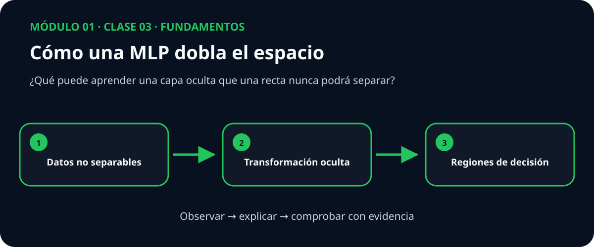

# Guía docente — Clase 03: MLP multiclase

> **Módulo 1: Fundamentos** · Esta guía acompaña a quien facilita la clase; no es un guion que deba leerse literalmente.

## La conversación que abre la clase

Dos clases pueden estar entrelazadas de manera que ninguna línea las divida. Las neuronas ocultas transforman primero el espacio para volver separable el problema.

Plantee primero esta pregunta y permita que el grupo formule una predicción antes de mostrar código:

> **¿Qué puede aprender una capa oculta que una recta nunca podrá separar?**

## Qué debe quedar comprendido

- Resolver clasificación no lineal con capas densas, activaciones y regularización.
- Preparar y auditar el dataset real dry_bean sin fuga de datos.
- Entrenar y evaluar red multicapa para relaciones no lineales.
- Comparar contra la línea base: Regresión logística multinomial y Random Forest.
- Interpretar intervalos de confianza, errores y limitaciones.

## Secuencia sugerida

| Momento | Duración | Acción docente | Evidencia del estudiante |
|---|---:|---|---|
| Activación | 10 min | Presentar el caso inicial y recoger predicciones. | Explica qué espera observar y por qué. |
| Construcción | 25 min | Conectar intuición, representación y matemática. | Dibuja o relata el mecanismo con sus propias palabras. |
| Demostración | 25 min | Recorrer el mapa visual y ejecutar el ejemplo mínimo. | Interpreta cada transición sin limitarse a describir la figura. |
| Investigación | 35 min | Guiar la práctica propia de esta clase. | Contrasta su predicción con una medida o gráfica. |
| Cierre | 15 min | Volver a la pregunta esencial y discutir límites. | Entrega una conclusión breve con evidencia y una duda abierta. |

## Práctica propia de esta materia

Comparar una frontera lineal con una MLP y relacionar las activaciones ocultas con las regiones de decisión.

La figura es un punto de entrada. Pida al estudiante que explique qué cambia entre los tres pasos y qué resultado observable invalidaría su explicación.

## Dificultad conceptual que conviene provocar

> **Idea engañosa:** Más capas no garantizan una mejor solución; añaden capacidad, costo y nuevas formas de sobreajustar.

No la corrija inmediatamente. Solicite un ejemplo o contraejemplo, ejecute una comparación y recién entonces reconstruya la explicación con el grupo.

## Preguntas para acompañar sin resolver

- ¿Qué observación concreta respalda esa afirmación?
- ¿Qué variable está cambiando y cuáles permanecen controladas?
- ¿La gráfica muestra el mecanismo o solamente una correlación?
- ¿En qué caso dejaría de ser válida esta conclusión?

## Cierre verificable

La clase termina cuando el estudiante puede responder la pregunta esencial, interpretar su visualización y señalar al menos una limitación. Una métrica aislada no reemplaza ninguna de esas tres evidencias.
