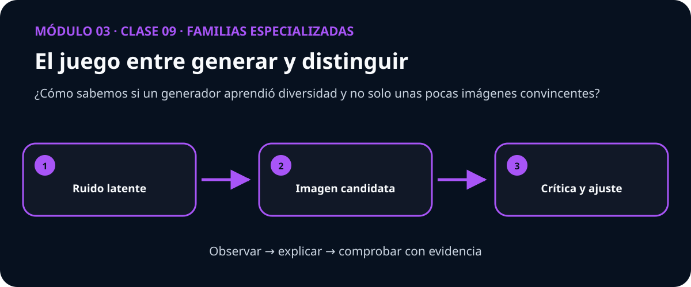

# Guía docente — Clase 09: GAN generativa

> **Módulo 3: Familias especializadas** · Esta guía acompaña a quien facilita la clase; no es un guion que deba leerse literalmente.

## La conversación que abre la clase

Una muestra bonita puede ocultar que el generador repite siempre la misma prenda. La evidencia está en la colección, no en la mejor imagen.

Plantee primero esta pregunta y permita que el grupo formule una predicción antes de mostrar código:

> **¿Cómo sabemos si un generador aprendió diversidad y no solo unas pocas imágenes convincentes?**

## Qué debe quedar comprendido

- Generar prendas a partir de imágenes reales de Fashion-MNIST.
- Preparar y auditar el dataset real fashion_mnist sin fuga de datos.
- Entrenar y evaluar aprendizaje adversarial generativo.
- Comparar contra la línea base: PCA generativa y distribución real de referencia.
- Interpretar intervalos de confianza, errores y limitaciones.

## Secuencia sugerida

| Momento | Duración | Acción docente | Evidencia del estudiante |
|---|---:|---|---|
| Activación | 10 min | Presentar el caso inicial y recoger predicciones. | Explica qué espera observar y por qué. |
| Construcción | 25 min | Conectar intuición, representación y matemática. | Dibuja o relata el mecanismo con sus propias palabras. |
| Demostración | 25 min | Recorrer el mapa visual y ejecutar el ejemplo mínimo. | Interpreta cada transición sin limitarse a describir la figura. |
| Investigación | 35 min | Guiar la práctica propia de esta clase. | Contrasta su predicción con una medida o gráfica. |
| Cierre | 15 min | Volver a la pregunta esencial y discutir límites. | Entrega una conclusión breve con evidencia y una duda abierta. |

## Práctica propia de esta materia

Recorrer el espacio latente, comparar vecinos y medir diversidad junto con la estabilidad adversarial.

La figura es un punto de entrada. Pida al estudiante que explique qué cambia entre los tres pasos y qué resultado observable invalidaría su explicación.

## Dificultad conceptual que conviene provocar

> **Idea engañosa:** Una pérdida baja del generador no garantiza calidad ni cobertura de todos los modos de los datos.

No la corrija inmediatamente. Solicite un ejemplo o contraejemplo, ejecute una comparación y recién entonces reconstruya la explicación con el grupo.

## Preguntas para acompañar sin resolver

- ¿Qué observación concreta respalda esa afirmación?
- ¿Qué variable está cambiando y cuáles permanecen controladas?
- ¿La gráfica muestra el mecanismo o solamente una correlación?
- ¿En qué caso dejaría de ser válida esta conclusión?

## Cierre verificable

La clase termina cuando el estudiante puede responder la pregunta esencial, interpretar su visualización y señalar al menos una limitación. Una métrica aislada no reemplaza ninguna de esas tres evidencias.
