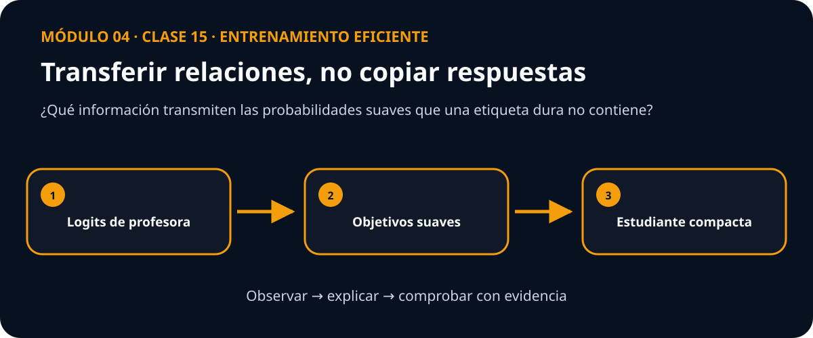

# Guía docente — Clase 15: Destilación de conocimiento

> **Módulo 4: Entrenamiento eficiente** · Esta guía acompaña a quien facilita la clase; no es un guion que deba leerse literalmente.

## La conversación que abre la clase

La profesora no solo dice «gato»; también muestra cuánto se parece la imagen a otras clases. Esa estructura guía a la estudiante compacta.

Plantee primero esta pregunta y permita que el grupo formule una predicción antes de mostrar código:

> **¿Qué información transmiten las probabilidades suaves que una etiqueta dura no contiene?**

## Qué debe quedar comprendido

- Transferir conocimiento de una CNN profesora a una estudiante compacta.
- Preparar y auditar el dataset real cifar10 sin fuga de datos.
- Entrenar y evaluar transferencia de conocimiento profesor-estudiante.
- Comparar contra la línea base: Estudiante entrenado solo con etiquetas.
- Interpretar intervalos de confianza, errores y limitaciones.

## Secuencia sugerida

| Momento | Duración | Acción docente | Evidencia del estudiante |
|---|---:|---|---|
| Activación | 10 min | Presentar el caso inicial y recoger predicciones. | Explica qué espera observar y por qué. |
| Construcción | 25 min | Conectar intuición, representación y matemática. | Dibuja o relata el mecanismo con sus propias palabras. |
| Demostración | 25 min | Recorrer el mapa visual y ejecutar el ejemplo mínimo. | Interpreta cada transición sin limitarse a describir la figura. |
| Investigación | 35 min | Guiar la práctica propia de esta clase. | Contrasta su predicción con una medida o gráfica. |
| Cierre | 15 min | Volver a la pregunta esencial y discutir límites. | Entrega una conclusión breve con evidencia y una duda abierta. |

## Práctica propia de esta materia

Variar temperatura y mezcla de pérdidas y construir el frente precisión–latencia–tamaño.

La figura es un punto de entrada. Pida al estudiante que explique qué cambia entre los tres pasos y qué resultado observable invalidaría su explicación.

## Dificultad conceptual que conviene provocar

> **Idea engañosa:** Una estudiante más pequeña no hereda automáticamente la calidad de la profesora; capacidad y temperatura limitan la transferencia.

No la corrija inmediatamente. Solicite un ejemplo o contraejemplo, ejecute una comparación y recién entonces reconstruya la explicación con el grupo.

## Preguntas para acompañar sin resolver

- ¿Qué observación concreta respalda esa afirmación?
- ¿Qué variable está cambiando y cuáles permanecen controladas?
- ¿La gráfica muestra el mecanismo o solamente una correlación?
- ¿En qué caso dejaría de ser válida esta conclusión?

## Cierre verificable

La clase termina cuando el estudiante puede responder la pregunta esencial, interpretar su visualización y señalar al menos una limitación. Una métrica aislada no reemplaza ninguna de esas tres evidencias.
