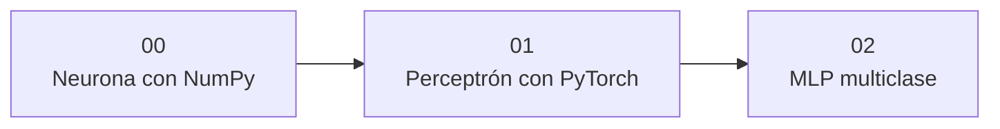

# 🟢 Módulo 1 — Fundamentos: de la derivada a la primera red

> 🧭 ⬅️ *primer módulo* · [🏠 Índice de módulos](README.md) · [📘 Portada](../README.md) · [Módulo 2 — Arquitecturas según la forma del dato ➡️](02-arquitecturas.md)

**Clases:** 01–03 · **Nivel:** fundamentos · **Dedicación estimada:** ~12 h

Se construye una red desde cero antes de usar cualquier abstracción: primero la neurona a mano en NumPy, después el mismo cálculo delegado en autograd, y por último varias capas resolviendo un problema que una recta no separa.

## 🧭 Secuencia del módulo

## 📚 Clases de este módulo

| # | Clase | Qué resuelve | Dataset | Horas |
|---:|---|---|---|---:|
| 01 | 🔢 [Neurona con NumPy](../labs/00_numpy_neuron/README.md) | Implementar propagación, entropía cruzada y descenso de gradiente sin autograd | `breast_cancer_wisconsin` | 4 |
| 02 | 🧩 [Perceptrón con PyTorch](../labs/01_pytorch_perceptron/README.md) | Aprender tensores, autograd, optimizadores y un clasificador lineal | `banknote_authentication` | 4 |
| 03 | 🌀 [MLP multiclase](../labs/02_mlp_nonlinear/README.md) | Resolver clasificación no lineal con capas densas, activaciones y regularización | `dry_bean` | 4 |

> Empieza por 🔢 **[Neurona con NumPy](../labs/00_numpy_neuron/README.md)** (clase 01 de 31). Sus documentos: [📄 Guía](../labs/00_numpy_neuron/README.md) · [🧠 Teoría](../labs/00_numpy_neuron/theory.md) · [🔬 Experimentos](../labs/00_numpy_neuron/experiments.md) · [📝 Evaluación](../labs/00_numpy_neuron/assessment.md).

## 🎯 Qué llevas al terminar

Al completar este módulo, entiendes qué calcula, qué deriva y qué actualiza un entrenamiento.

Todas las clases comparten el mismo contrato: los transformadores se ajustan solo con
`train`, `validation` decide el modelo y `test` se abre una única vez tras escribir
`experiment.lock.json`.

---

⬅️ *primer módulo* · [🏠 Índice de módulos](README.md) · [📘 Portada del repositorio](../README.md) · [Módulo 2 — Arquitecturas según la forma del dato ➡️](02-arquitecturas.md)
