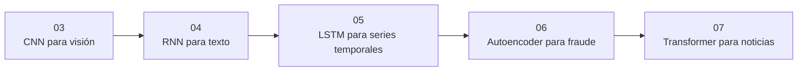

# 🔵 Módulo 2 — Arquitecturas según la forma del dato

> 🧭 [⬅️ Módulo 1 — Fundamentos: de la derivada a la primera red](01-fundamentos.md) · [🏠 Índice de módulos](README.md) · [📘 Portada](../README.md) · [Módulo 3 — Familias especializadas: generar, decidir, relacionar ➡️](03-familias-especializadas.md)

**Clases:** 04–08 · **Nivel:** intermedio · avanzado · **Dedicación estimada:** ~32 h

Cada estructura —imagen, secuencia, serie temporal, señal sin etiqueta, texto— pide su propio sesgo inductivo. Aquí se recorren las cinco familias que cubren la mayoría de los problemas reales, y se comparan contra una línea base honesta.

## 🧭 Secuencia del módulo

## 📚 Clases de este módulo

| # | Clase | Qué resuelve | Dataset | Horas |
|---:|---|---|---|---:|
| 04 | 🖼️ [CNN para visión](../labs/03_cnn_vision/README.md) | Entrenar una CNN y analizar errores sobre fotografías reales de diez clases | `cifar10` | 6 |
| 05 | 🔁 [RNN para texto](../labs/04_rnn_sequences/README.md) | Clasificar sentimiento en reseñas reales usando embeddings y recurrencia | `imdb` | 6 |
| 06 | 📈 [LSTM para series temporales](../labs/05_lstm_time_series/README.md) | Pronosticar demanda horaria respetando el orden temporal | `seoul_bike` | 6 |
| 07 | 🧬 [Autoencoder para fraude](../labs/06_autoencoder_anomaly/README.md) | Detectar transacciones fraudulentas mediante error de reconstrucción | `credit_card_fraud` | 6 |
| 08 | 🔭 [Transformer para noticias](../labs/07_transformer_attention/README.md) | Aplicar atención multi-cabeza a clasificación de noticias reales | `ag_news` | 8 |

> Empieza por 🖼️ **[CNN para visión](../labs/03_cnn_vision/README.md)** (clase 04 de 31). Sus documentos: [📄 Guía](../labs/03_cnn_vision/README.md) · [🧠 Teoría](../labs/03_cnn_vision/theory.md) · [🔬 Experimentos](../labs/03_cnn_vision/experiments.md) · [📝 Evaluación](../labs/03_cnn_vision/assessment.md).

## 🎯 Qué llevas al terminar

Al completar este módulo, eliges arquitectura por la forma del problema, no por la moda.

Todas las clases comparten el mismo contrato: los transformadores se ajustan solo con
`train`, `validation` decide el modelo y `test` se abre una única vez tras escribir
`experiment.lock.json`.

---

[⬅️ Módulo 1 — Fundamentos: de la derivada a la primera red](01-fundamentos.md) · [🏠 Índice de módulos](README.md) · [📘 Portada del repositorio](../README.md) · [Módulo 3 — Familias especializadas: generar, decidir, relacionar ➡️](03-familias-especializadas.md)
