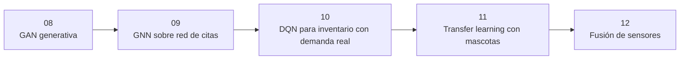

# 🟣 Parte 3 — Familias especializadas: generar, decidir, relacionar

> 🧭 [⬅️ Parte 2 — Arquitecturas según la forma del dato](02-arquitecturas.md) · [🏠 Índice de partes](README.md) · [📘 Portada](../README.md) · [Parte 4 — Entrenar mejor, más barato y sin centralizar datos ➡️](04-entrenamiento-eficiente.md)

**Rutas:** 08–12 · **Clases:** 5 · **Nivel:** avanzado · **Dedicación estimada:** ~40 h

Tres regímenes donde una métrica de acierto ya no cuenta toda la historia —generación, decisión secuencial y datos relacionales— más las dos formas de reutilizar y combinar información que ya existe.

## 🧭 Secuencia de la parte

## 📚 Clases de esta parte

| # | Clase | Qué resuelve | Dataset | Horas |
|---:|---|---|---|---:|
| 08 | 🎨 [GAN generativa](../labs/08_gan_generation/README.md) | Generar prendas a partir de imágenes reales de Fashion-MNIST | `fashion_mnist` | 8 |
| 09 | 🕸️ [GNN sobre red de citas](../labs/09_gnn_graphs/README.md) | Clasificar publicaciones científicas usando texto y enlaces de citas | `cora` | 8 |
| 10 | 🕹️ [DQN para inventario con demanda real](../labs/10_dqn_reinforcement/README.md) | Aprender una política de reposición usando una secuencia de demanda observada en transacciones reales | `online_retail` | 8 |
| 11 | ♻️ [Transfer learning con mascotas](../labs/11_transfer_learning/README.md) | Comparar extracción de características, fine-tuning y entrenamiento desde cero | `oxford_iiit_pet` | 8 |
| 12 | 🔀 [Fusión de sensores](../labs/12_multimodal_fusion/README.md) | Fusionar acelerómetro y giroscopio de smartphones para reconocer actividades | `uci_har` | 8 |

> Empieza por 🎨 **[GAN generativa](../labs/08_gan_generation/README.md)** (ruta 9 de 31). Sus documentos: [📄 Guía](../labs/08_gan_generation/README.md) · [🧠 Teoría](../labs/08_gan_generation/theory.md) · [🔬 Experimentos](../labs/08_gan_generation/experiments.md) · [📝 Evaluación](../labs/08_gan_generation/assessment.md).

## 🎯 Qué llevas al terminar

Al completar esta parte, evalúas sistemas que no tienen una única etiqueta correcta.

Todas las clases comparten el mismo contrato: los transformadores se ajustan solo con
`train`, `validation` decide el modelo y `test` se abre una única vez tras escribir
`experiment.lock.json`.

---

[⬅️ Parte 2 — Arquitecturas según la forma del dato](02-arquitecturas.md) · [🏠 Índice de partes](README.md) · [📘 Portada del repositorio](../README.md) · [Parte 4 — Entrenar mejor, más barato y sin centralizar datos ➡️](04-entrenamiento-eficiente.md)
