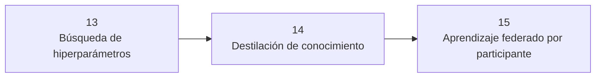

# 🟠 Módulo 4 — Entrenar mejor, más barato y sin centralizar datos

> 🧭 [⬅️ Módulo 3 — Familias especializadas: generar, decidir, relacionar](03-familias-especializadas.md) · [🏠 Índice de módulos](README.md) · [📘 Portada](../README.md) · [Módulo 5 — La mecánica fina, ahora en profundidad ➡️](05-mecanica-fina.md)

**Clases:** 14–16 · **Nivel:** avanzado · **Dedicación estimada:** ~24 h

El modelo ya funciona: ahora hay que mejorarlo sin hacer trampas, encogerlo para que quepa donde debe correr, y entrenarlo cuando los datos no pueden salir de donde están.

## 🧭 Secuencia del módulo

## 📚 Clases de este módulo

| # | Clase | Qué resuelve | Dataset | Horas |
|---:|---|---|---|---:|
| 14 | 🎛️ [Búsqueda de hiperparámetros](../labs/13_hyperparameter_search/README.md) | Optimizar profundidad, ancho, dropout y learning rate sin tocar test | `adult_census` | 8 |
| 15 | ⚗️ [Destilación de conocimiento](../labs/14_knowledge_distillation/README.md) | Transferir conocimiento de una CNN profesora a una estudiante compacta | `cifar10` | 8 |
| 16 | 🌐 [Aprendizaje federado por participante](../labs/15_federated_learning/README.md) | Aplicar FedAvg usando participantes reales como clientes naturales | `uci_har_subjects` | 8 |

> Empieza por 🎛️ **[Búsqueda de hiperparámetros](../labs/13_hyperparameter_search/README.md)** (clase 14 de 31). Sus documentos: [📄 Guía](../labs/13_hyperparameter_search/README.md) · [🧠 Teoría](../labs/13_hyperparameter_search/theory.md) · [🔬 Experimentos](../labs/13_hyperparameter_search/experiments.md) · [📝 Evaluación](../labs/13_hyperparameter_search/assessment.md).

## 🎯 Qué llevas al terminar

Al completar este módulo, mejoras un modelo sin tocar `test` y sabes qué cuesta cada mejora.

Todas las clases comparten el mismo contrato: los transformadores se ajustan solo con
`train`, `validation` decide el modelo y `test` se abre una única vez tras escribir
`experiment.lock.json`.

---

[⬅️ Módulo 3 — Familias especializadas: generar, decidir, relacionar](03-familias-especializadas.md) · [🏠 Índice de módulos](README.md) · [📘 Portada del repositorio](../README.md) · [Módulo 5 — La mecánica fina, ahora en profundidad ➡️](05-mecanica-fina.md)
