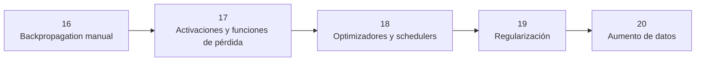

# 🔴 Módulo 5 — La mecánica fina, ahora en profundidad

> 🧭 [⬅️ Módulo 4 — Entrenar mejor, más barato y sin centralizar datos](04-entrenamiento-eficiente.md) · [🏠 Índice de módulos](README.md) · [📘 Portada](../README.md) · [Módulo 6 — Confiar en el modelo y sacarlo del cuaderno ➡️](06-confianza-y-despliegue.md)

**Clases:** 17–21 · **Nivel:** fundamentos · intermedio · **Dedicación estimada:** ~24 h

Segunda pasada por el motor, ya con la experiencia de haber entrenado modelos reales: lo que en la clase 01 era una fórmula, aquí es una decisión de diseño que se mide, se compara entre semillas y se justifica.

## 🧭 Secuencia del módulo

## 📚 Clases de este módulo

| # | Clase | Qué resuelve | Dataset | Horas |
|---:|---|---|---|---:|
| 17 | ∂ [Backpropagation manual](../labs/16_backpropagation_manual/README.md) | Derivar y programar backpropagation en una MLP pequeña | `iris` | 4 |
| 18 | 📐 [Activaciones y funciones de pérdida](../labs/17_activations_and_losses/README.md) | Comparar ReLU, GELU, Tanh y pérdidas apropiadas en clases desbalanceadas | `wine_quality` | 4 |
| 19 | ⚙️ [Optimizadores y schedulers](../labs/18_optimizers_and_schedulers/README.md) | Comparar SGD, Momentum, Adam y reducción de tasa de aprendizaje | `california_housing` | 4 |
| 20 | 🛡️ [Regularización](../labs/19_regularization_dropout_batchnorm/README.md) | Medir dropout, weight decay y batch normalization | `fashion_mnist` | 6 |
| 21 | 🔄 [Aumento de datos](../labs/20_data_augmentation/README.md) | Comparar recortes, volteos y perturbaciones sobre imágenes reales | `cifar10` | 6 |

> Empieza por ∂ **[Backpropagation manual](../labs/16_backpropagation_manual/README.md)** (clase 17 de 31). Sus documentos: [📄 Guía](../labs/16_backpropagation_manual/README.md) · [🧠 Teoría](../labs/16_backpropagation_manual/theory.md) · [🔬 Experimentos](../labs/16_backpropagation_manual/experiments.md) · [📝 Evaluación](../labs/16_backpropagation_manual/assessment.md).

## 🎯 Qué llevas al terminar

Al completar este módulo, explicas por qué un entrenamiento converge, se estanca o sobreajusta.

Todas las clases comparten el mismo contrato: los transformadores se ajustan solo con
`train`, `validation` decide el modelo y `test` se abre una única vez tras escribir
`experiment.lock.json`.

---

[⬅️ Módulo 4 — Entrenar mejor, más barato y sin centralizar datos](04-entrenamiento-eficiente.md) · [🏠 Índice de módulos](README.md) · [📘 Portada del repositorio](../README.md) · [Módulo 6 — Confiar en el modelo y sacarlo del cuaderno ➡️](06-confianza-y-despliegue.md)
