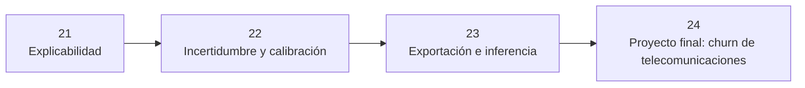

# ⚫ Parte 6 — Confiar en el modelo y sacarlo del cuaderno

> 🧭 [⬅️ Parte 5 — La mecánica fina, ahora en profundidad](05-mecanica-fina.md) · [🏠 Índice de partes](README.md) · [📘 Portada](../README.md) · [Parte 7 — Especializaciones avanzadas ➡️](07-especializaciones-avanzadas.md)

**Rutas:** 21–24 · **Clases:** 4 · **Nivel:** avanzado · proyecto · **Dedicación estimada:** ~34 h

Un acierto sin explicación ni confianza calibrada no es evidencia, y un modelo que solo corre en un cuaderno no es un sistema. Esta parte cierra el ciclo hasta el artefacto desplegable y el proyecto integrador.

## 🧭 Secuencia de la parte

## 📚 Clases de esta parte

| # | Clase | Qué resuelve | Dataset | Horas |
|---:|---|---|---|---:|
| 21 | 🔍 [Explicabilidad](../labs/21_explainability/README.md) | Explicar predicciones con Integrated Gradients y permutación | `adult_census` | 8 |
| 22 | 🎯 [Incertidumbre y calibración](../labs/22_uncertainty_calibration/README.md) | Medir confianza, Brier score, ECE y temperature scaling | `breast_cancer_wisconsin` | 8 |
| 23 | 📦 [Exportación e inferencia](../labs/23_model_export_and_inference/README.md) | Exportar ONNX, validar paridad y medir latencia por lotes | `cifar10` | 8 |
| 24 | 🏁 [Proyecto final: churn de telecomunicaciones](../labs/24_capstone_real_project/README.md) | Resolver de extremo a extremo un problema real de abandono de clientes con documentación, evaluación y despliegue | `iranian_churn` | 10 |

> Empieza por 🔍 **[Explicabilidad](../labs/21_explainability/README.md)** (ruta 22 de 31). Sus documentos: [📄 Guía](../labs/21_explainability/README.md) · [🧠 Teoría](../labs/21_explainability/theory.md) · [🔬 Experimentos](../labs/21_explainability/experiments.md) · [📝 Evaluación](../labs/21_explainability/assessment.md).

## 🎯 Qué llevas al terminar

Al completar esta parte, respondes «¿por qué predijo esto?», «¿cuánto te fías?» y «¿cuánto tarda?».

Todas las clases comparten el mismo contrato: los transformadores se ajustan solo con
`train`, `validation` decide el modelo y `test` se abre una única vez tras escribir
`experiment.lock.json`.

---

[⬅️ Parte 5 — La mecánica fina, ahora en profundidad](05-mecanica-fina.md) · [🏠 Índice de partes](README.md) · [📘 Portada del repositorio](../README.md) · [Parte 7 — Especializaciones avanzadas ➡️](07-especializaciones-avanzadas.md)
