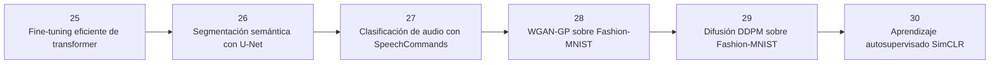

# 🔬 Módulo 7 — Especializaciones avanzadas

> 🧭 [⬅️ Módulo 6 — Confiar en el modelo y sacarlo del cuaderno](06-confianza-y-despliegue.md) · [🏠 Índice de módulos](README.md) · [📘 Portada](../README.md) · *último módulo* ➡️

**Clases:** 26–31 · **Nivel:** avanzado · **Dedicación estimada:** ~48 h

Mismo contrato de semillas, selección por validación y sellado del test, con arquitecturas de frontera y pesos preentrenados descargados de su proveedor. Se pueden tomar en cualquier orden una vez completadas las clases 01–25.

## 🧭 Secuencia del módulo

## 📚 Clases de este módulo

| # | Clase | Qué resuelve | Dataset | Horas |
|---:|---|---|---|---:|
| 26 | 🔧 [Fine-tuning eficiente de transformer](../advanced_labs/25_transformer_finetuning/README.md) | Comparar fine-tuning completo y LoRA sin tocar test durante selección | `ag_news` | 8 |
| 27 | 🧷 [Segmentación semántica con U-Net](../advanced_labs/26_segmentation_unet/README.md) | Segmentar mascota, fondo y contorno con IoU por clase | `oxford_iiit_pet_segmentation` | 8 |
| 28 | 🎙️ [Clasificación de audio con SpeechCommands](../advanced_labs/27_audio_speechcommands/README.md) | Clasificar comandos hablados desde waveform y log-mel spectrograms | `speechcommands_v0.02` | 8 |
| 29 | 🖌️ [WGAN-GP sobre Fashion-MNIST](../advanced_labs/28_wgan_gp/README.md) | Estudiar estabilidad generativa y gradient penalty con imágenes reales | `fashion_mnist` | 8 |
| 30 | 🌫️ [Difusión DDPM sobre Fashion-MNIST](../advanced_labs/29_diffusion_ddpm/README.md) | Aprender predicción de ruido y muestreo iterativo sobre imágenes reales | `fashion_mnist` | 8 |
| 31 | 🪞 [Aprendizaje autosupervisado SimCLR](../advanced_labs/30_self_supervised_simclr/README.md) | Preentrenar representaciones con dos vistas reales y evaluar mediante linear probe | `cifar10` | 8 |

> Empieza por 🔧 **[Fine-tuning eficiente de transformer](../advanced_labs/25_transformer_finetuning/README.md)** (clase 26 de 31). Sus documentos: [📄 Guía](../advanced_labs/25_transformer_finetuning/README.md) · [🧠 Teoría](../advanced_labs/25_transformer_finetuning/theory.md) · [🔬 Experimentos](../advanced_labs/25_transformer_finetuning/experiments.md) · [📝 Evaluación](../advanced_labs/25_transformer_finetuning/assessment.md).

## 🎯 Qué llevas al terminar

Al completar este módulo, trabajas con arquitecturas actuales sin renunciar al protocolo.

Todas las clases comparten el mismo contrato: los transformadores se ajustan solo con
`train`, `validation` decide el modelo y `test` se abre una única vez tras escribir
`experiment.lock.json`.

---

[⬅️ Módulo 6 — Confiar en el modelo y sacarlo del cuaderno](06-confianza-y-despliegue.md) · [🏠 Índice de módulos](README.md) · [📘 Portada del repositorio](../README.md) · *último módulo* ➡️
